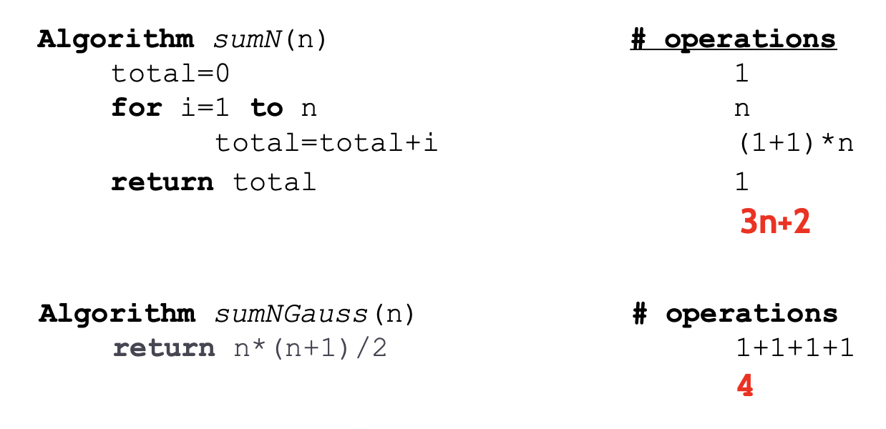

# Analysis of Algorithms
## Definitions:

 - An algorith is a set of steps to solve a problem.
   - A problem can have multiple solutions
     - Study the efficiency of Algorithms:
       - Time complexity _(More important)_
       <details> 
       <summary> Time complexity how to </summary> 
       <p>
       
         - Empirical Analysis of Algorithms
             1. Write the program
             2. Run the program with instructions to measure the execution time
             3. Run the program with inputs of different sizes
             4. Plot the results
         - _Example:_
           ```python
           # Step 1  
           def sumOfN(n):
                theSum = 0
                for i in range(1, n+1):
                    theSum += i
                return theSum
             ```
           ```python
           # Step 2
           import time
           def sumOfN(n):
                start = time.time()
                theSum = 0
                for i in range(1, n+1):
                    theSum += I
                end = time.time()
                return theSum, end-start
           ``` 
       
        
       - If we use the Gauss Solution, we obtain this other graph with this code:
         ```python
         import time
         def SumOfN2(n):
          start = time.time()
          theSum = n*(n+1) / 2
          end = time.time()
          return theSum, end-start
         ```
       
     </p> </details>
     - T(n) is the **number of operations executed by an algorithm** to process
     an input of size n. **Examples**: 
       1. T1(n) = 3n+5
       2. T2(n) = n^2-4n+6 
       
       • Pseudocode, independent of the hardware/software environment
     
 Primitive Operations take 1 nanosecond, for example ````x = 3, vector[3], return x, x+3, i<size````

<details>
    <summary>Examples of Code analyzing time</summary>
    <p>

Example of how much a function takes:

| Code              | # Of Operations |
|-------------------|-----------------|
| for i=1 to n      | 1*n             |
| total = total + i | 2n              |
| Total             | 3n              |

Example 2:

| Code         | # Of Operations  |
|--------------|------------------|
| for i=1 to n | 1*n              |
| for j=1 to n | 1\*n\*n => n^2   |
| print\(i*j\) | 2\*n\*n => 2*n^2 |
| Total        | 3n^2 +n          | 


<details>
<summary>Examples with if statements</summary>
<p> 


</p>
</details>

<details>
<summary>Comparison of time taken between algorithms</summary>
<p>



</p>
</details></p></details>

### Big O Notation:
- **Big O** is used to describe the runtime tendency of an algorithm **(growth rate)**
- Different functions with the same growth rate may be represented using the same O notation.


| _Order_       | _Name_       | _Description_                 | _Example_                                         | 
|---------------|:-------------|-------------------------------|:--------------------------------------------------|
| **1**         | Constant     | Independent of the input size | Remove the first element from a queue             |
| **Log2(n)**   | Logarithmic  | Divide in half                | Binary search                                     |
| **N**         | Linear       | Loop                          | Sum of array elements                             |
| **nLog2 (n)** | Linearithmic | Divide and conquer            | Mergesort, quicksort                              | 
| **N^2**       | Quadratic    | Double loop                   | Add two matrices; bubble sort                     |
| **N^3**       | Cubic        | Triple loop                   | Multiply two matrices                             |
| **k^n**       | Exponential  | Exhaustive search             | Guess a password (k s the length of the password) |
| **n!**        | Factorial    | Brute-force search            | Enumerate all partitions of a set                 |


| T(n)               | Big O  | 
|--------------------|--------|
| n+2                | O(n)   |
| (n+1)(n-1)         | O(n^2) |
| 3n + log(n)        | O(n)   |
| n(n-1)             | O(n^2) |
| 7n^4 + 5n^2 + 1    | O(n^4) | 
|                    |        | 
| 4                  | O(1)   |
| 3n + 4             | O(n)   |
| 5n2+ 27n + 1005    | O(n^2) |
| 10n3+ 2n2 + 7n + 1 | O(n^3) |
| n!+ n5             | O(n!)  |

Different time complexity with loops:

| T(n)                                                            | Big O  | 
|-----------------------------------------------------------------|--------|
| for i=1 to n:<br/>&nbsp;&nbsp; </tab>for j=1 to n: <br/> for k=1 to n | O(n^3) |


##Exercise class:

```python
for i in range(len(list1)):  # O(n)
    if i > 10:               # O(1*n) Porque se repite n veces por el for
        print("hello")       # O(1)
```
The Big-o notation of this program is O(n)